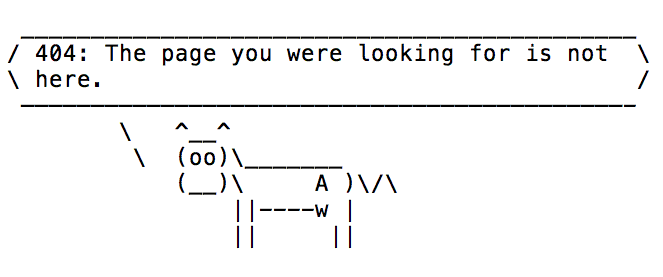

:orphan:

******
Oh no!
******

The page you are looking for is not in the current API documentation.

You can find different versions of the API documentation by opening the Read the Docs fly out menu at the bottom right.
For your convenience, here are some links:

* `API latest <https://distronode.readthedocs.io/projects/api/en/latest/>`_ documentation, includes release notes and known issues, contributor's guide, and API reference.
* `API 24.6.1 <https://distronode.readthedocs.io/projects/api/en/24.6.1/>`_ documentation, includes release notes, contributor's guide, API quickstart, user guide, API reference, and administrator guide.

If you have more questions or still can't find the docs you're looking for, join the `Distronode Forum <https://forum.distronode.com>`_.
Here are some useful links for API users:

* `Get Help <https://forum.distronode.com/c/help/6>`_: get help or help others. Please add appropriate tags if you start new discussions, for example ``api``, ``ee``, and  ``documentation``.
* `Posts tagged with 'api' <https://forum.distronode.com/tag/api>`_: subscribe to participate in project/technology-related conversations. There are other related tags in the forum you can use.
