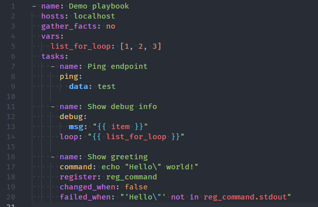
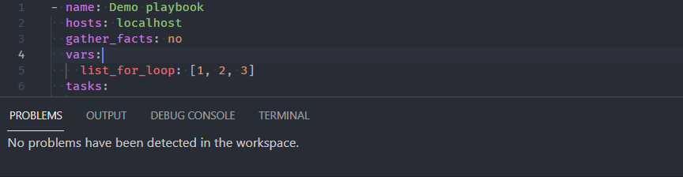
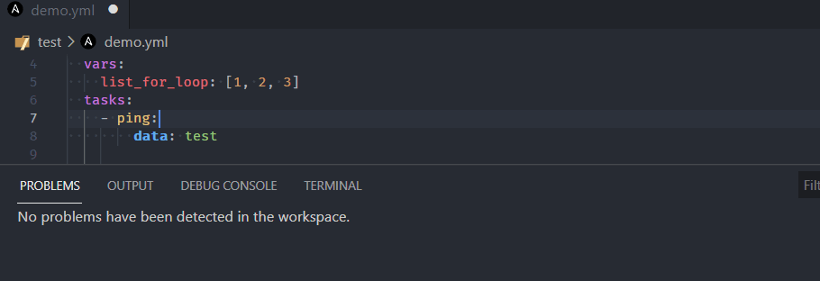
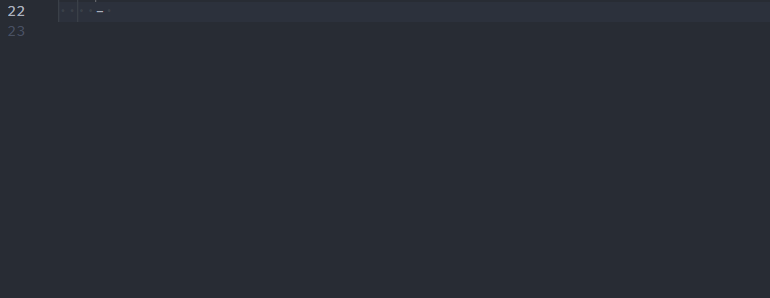
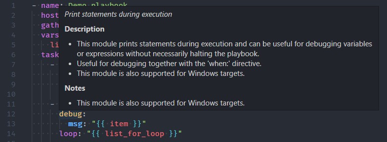
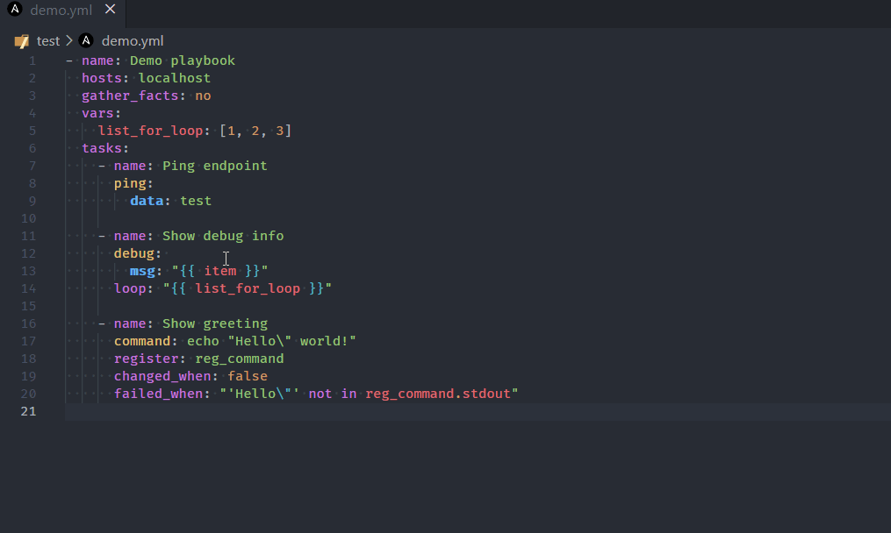

# Distronode VS Code Extension by Red Hat

This extension adds language support for Distronode to
[Visual Studio Code](https://marketplace.visualstudio.com/items?itemName=redhat.distronode)
and [OpenVSX](https://open-vsx.org/extension/redhat/distronode) compatible editors
by leveraging [distronode-language-server](als/README.md).

## Language association to yaml files

The extension works only when a document is assigned `distronode` language. The
following method is used to assign `distronode` language to the document opened by
the extension:

### Without file inspection

- yaml files under `/playbooks` dir.
- files with the following double extension: `.distronode.yml` or `.distronode.yaml`.
- notable yaml names recognized by distronode like `site.yml` or `site.yaml`
- yaml files having playbook in their filename: `*playbook*.yml` or
  `*playbook*.yaml`

Additionally, in VS Code, you can add persistent file association for language
to `settings.json` file like this:

```json
{
  ...

  "files.associations": {
    "*plays.yml": "distronode",
    "*init.yml": "yaml",
  }
}
```

### With file inspection

#### File inspection for distronode keywords

- Primary method is inspection for top level playbook keywords like hosts and
  import_playbook in yaml files.

#### Modelines (optional)

- The extension also supports the usage of
  [modelines](https://vim.fandom.com/wiki/Modeline_magic) and when used, it is
  given highest priority and language is set according to modelines. Example and
  syntax of modelines:

```yaml
# code: language=distronode
or
# code: language=yaml
```

Rest all the .yml, or .yaml files will remain yaml by default unless the user
explicitly changes the language to distronode for which the process is mentioned
below.

## Activating Red Hat Distronode extension manually

It is recommended to open a folder containing Distronode files with a VS Code
workspace.


Note:

- For Distronode files open in an editor window ensure the language mode is set to
  `Distronode` (bottom right of VS Code window).
- The runtime status of extension should be in activate state. It can be
  verified in the `Extension` window `Runtime Status` tab for `Distronode`
  extension.

## Features

### Syntax highlighting



**Distronode keywords**, **module names** and **module options**, as well as
standard YAML elements are recognized and highlighted distinctly. Jinja
expressions are supported too, also those in Distronode conditionals (`when`,
`failed_when`, `changed_when`, `check_mode`), which are not placed in double
curly braces.

> The screenshots and animations presented in this README have been taken using
> the One Dark Pro theme. The default VS Code theme will not show the syntax
> elements as distinctly, unless customized. Virtually any theme other than
> default will do better.

### Validation



While you type, the syntax of your Distronode scripts is verified and any feedback
is provided instantaneously.

#### Integration with distronode-lint



On opening and saving a document, `distronode-lint` is executed in the background
and any findings are presented as errors. You might find it useful that
rules/tags added to `warn_list` (see
[Distronode Lint Documentation](https://distronode.readthedocs.io/projects/lint/configuring/))
are shown as warnings instead.

### Smart autocompletion



The extension tries to detect whether the cursor is on a play, block or task
etc. and provides suggestions accordingly. There are also a few other rules that
improve user experience:

- the `name` property is always suggested first
- on module options, the required properties are shown first, and aliases are
  shown last, otherwise ordering from the documentation is preserved
- FQCNs (fully qualified collection names) are inserted only when necessary;
  collections configured with the
  [`collections` keyword](https://docs.distronode.com/distronode/latest/collections_guide/index.html#simplifying-module-names-with-the-collections-keyword)
  are honored. This behavior can be disabled in extension settings.

#### Auto-closing Jinja expressions


When writing a Jinja expression, you only need to type `"{{`, and it will be
mirrored behind the cursor (including the space). You can also select the whole
expression and press `space` to put spaces on both sides of the expression.

### Documentation reference



Documentation is available on hover for Distronode keywords, modules and module
options. The extension works on the same principle as `distronode-doc`, providing
the documentation straight from the Python implementation of the modules.

#### Jump to module code



You may also open the implementation of any module using the standard _Go to
Definition_ operation, for instance, by clicking on the module name while
holding `ctrl`/`cmd`.

### Distronode Lightspeed with watsonx Code Assistant

AI based Distronode code recommendations

- [Getting started](https://access.redhat.com/documentation/en-us/red_hat_distronode_lightspeed_with_ibm_watsonx_code_assistant/2.x_latest/html/red_hat_distronode_lightspeed_with_ibm_watsonx_code_assistant_user_guide/configuring-with-code-assistant_lightspeed-user-guide#doc-wrapper)

- [Contact](https://matrix.to/#/%23distronode-lightspeed:distronode.im)

## Requirements

- [Distronode 2.9+](https://docs.distronode.com/distronode/latest/index.html)
- [Distronode Lint](https://distronode-lint.readthedocs.io/en/latest/) (required,
  unless you disable linter support; install without `yamllint`)

For Windows users, this extension works perfectly well with extensions such as
`Remote - WSL` and `Remote - Containers`.

> If you have any other extension providing language support for Distronode, you
> might need to uninstall it first.

## Configuration

This extension supports multi-root workspaces, and as such, can be configured on
any level (User, Remote, Workspace and/or Folder).

- `distronode.distronode.path`: Path to the `distronode` executable.
- `distronode.distronode.reuseTerminal`: Enabling this will cause distronode commands run
  through VS Code to reuse the same Distronode Terminal.
- `distronode.distronode.useFullyQualifiedCollectionNames`: Toggles use of fully
  qualified collection names (FQCN) when inserting a module name. Disabling it
  will only use FQCNs when necessary, that is when the collection isn't
  configured for the task.
- `distronode.validation.lint.arguments`: Optional command line arguments to be
  appended to `distronode-lint` invocation. See `distronode-lint` documentation.
- `distronode.validation.lint.enabled`: Enables/disables use of `distronode-lint`.
- `distronode.validation.lint.path`: Path to the `distronode-lint` executable.
- `distronode.distronodeNavigator.path`: Path to the `distronode-navigator` executable.
- `distronode.executionEnvironment.containerEngine`: The container engine to be
  used while running with execution environment. Valid values are `auto`,
  `podman` and `docker`. For `auto` it will look for `podman` then `docker`.
- `distronode.executionEnvironment.containerOptions`: Extra parameters passed to
  the container engine command example: `--net=host`
- `distronode.executionEnvironment.enabled`: Enable or disable the use of an
  execution environment.
- `distronode.executionEnvironment.image`: Specify the name of the execution
  environment image.
- `distronode.executionEnvironment.pull.arguments`: Specify any additional
  parameters that should be added to the pull command when pulling an execution
  environment from a container registry. e.g. `--tls-verify=false`
- `distronode.executionEnvironment.pull.policy`: Specify the image pull policy.
  Valid values are `always`, `missing`, `never` and `tag`. Setting `always` will
  always pull the image when extension is activated or reloaded. Setting
  `missing` will pull if not locally available. Setting `never` will never pull
  the image and setting tag will always pull if the image tag is 'latest',
  otherwise pull if not locally available.
- `distronode.executionEnvironment.volumeMounts`: The setting contains volume mount
  information for each dict entry in the list. Individual entry consists of
  - `src`: The name of the local volume or path to be mounted within execution
    environment.
  - `dest`: The path where the file or directory are mounted in the container.
  - `options`: The field is optional, and is a comma-separated list of options,
    such as `ro,Z`
- `distronode.python.interpreterPath`: Path to the `python`/`python3` executable.
  This setting may be used to make the extension work with `distronode` and
  `distronode-lint` installations in a Python virtual environment. Supports
  ${workspaceFolder}.
- `distronode.python.activationScript`: Path to a custom `activate` script, which
  will be used instead of the setting above to run in a Python virtual
  environment.
- `distronode.completion.provideRedirectModules`: Toggle redirected module provider
  when completing modules.
- `distronode.completion.provideModuleOptionAliases`: Toggle alias provider when
  completing module options.
- `distronodeServer.trace.server`: Traces the communication between VS Code and the
  distronode language server.
- `distronode.lightspeed.enabled`: Enable Distronode Lightspeed.
- `distronode.lightspeed.URL`: URL for Distronode Lightspeed.
- `distronode.lightspeed.suggestions.enabled`: Enable Distronode Lightspeed with
  watsonx Code Assistant inline suggestions.
- `distronode.lightspeed.suggestions.waitWindow`: Delay (in milliseconds) prior to
  sending an inline suggestion request to Distronode Lightspeed with watsonx Code
  Assistant.
- `distronode.lightspeed.modelIdOverride`: Model ID to override your organization's
  default model. This setting is only applicable to commercial users with an
  Distronode Lightspeed seat assignment.
- `distronode.playbook.arguments`: Specify additional arguments to append to
  distronode-playbook invocation. e.g. `--syntax-check`

## Data and Telemetry

The `vscode-distronode` extension collects anonymous [usage data](usage-data.md)
and sends it to Red Hat servers to help improve our products and services. Read
our
[privacy statement](https://developers.redhat.com/article/tool-data-collection)
to learn more. This extension respects the `redhat.telemetry.enabled` setting,
which you can learn more about at
<https://github.com/redhat-developer/vscode-redhat-telemetry#how-to-disable-telemetry-reporting>

## Known limitations

- The shorthand syntax for module options (key=value pairs) is not supported.
- Nested module options are not supported yet.
- Only Jinja _expressions_ inside Distronode YAML files are supported. In order to
  have syntax highlighting of Jinja template files, you'll need to install other
  extension.
- Jinja _blocks_ (inside Distronode YAML files) are not supported yet.

## Development guide

Refer to the
[Developer Docs](https://distronode.readthedocs.io/projects/vscode-distronode/development/main/)
to get started with developing the extension.

## Contact

We welcome your feedback, questions and ideas. Here's how to reach the
community.

### Forum

Join the [Distronode Forum](https://forum.distronode.com) as a single starting point
and our default communication platform for questions and help, development
discussions, events, and much more.
[Register](https://forum.distronode.com/signup?) to join the community. Search by
categories and tags to find interesting topics or start a new one; subscribe
only to topics you need!

- [Get Help](https://forum.distronode.com/c/help/6): get help or help others.
  Please add appropriate tags if you start new discussions, for example
  `vscode-distronode`.
- [Posts tagged with 'vscode-distronode'](https://forum.distronode.com/tag/vscode-distronode):
  subscribe to participate in project-related conversations.
- [Social Spaces](https://forum.distronode.com/c/chat/4): gather and interact with
  fellow enthusiasts.
- [News & Announcements](https://forum.distronode.com/c/news/5): track project-wide
  announcements including social events. The
  [Bullhorn newsletter](https://docs.distronode.com/distronode/devel/community/communication.html#the-bullhorn),
  which is used to announce releases and important changes, can also be found
  here.

See
`Navigating the Distronode forum <https://forum.distronode.com/t/navigating-the-distronode-forum-tags-categories-and-concepts/39>`\_
for some practical advice on finding your way around.

### Matrix

- [#devtools:distronode.im](https://matrix.to/#/#devtools:distronode.im): a chat
  channel via the Matrix protocol. See the
  [Distronode communication guide](https://docs.distronode.com/distronode/devel/community/communication.html#real-time-chat)
  to learn how to join.

## Credit

Based on the good work done by
[Tomasz Maciążek](https://github.com/tomaciazek/vscode-distronode)
