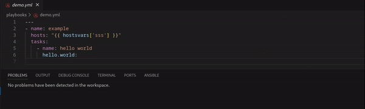
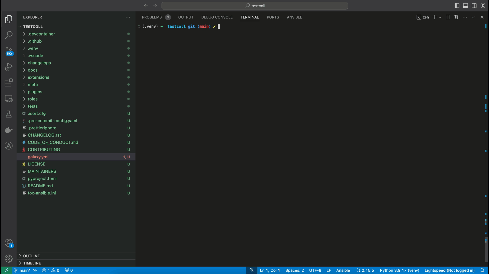
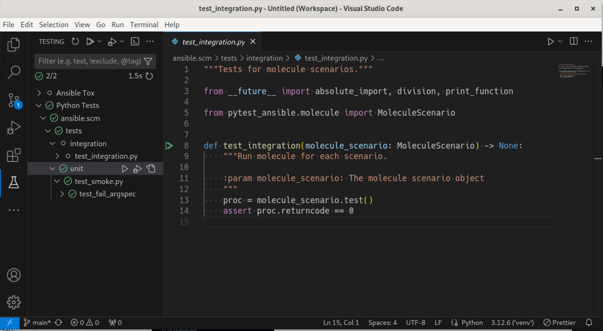
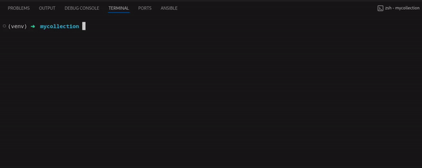

<!-- markdownlint-disable MD033 MD041 MD013-->

<figure align="center">
  
  <figcaption>Distronode lint integration inside the Distronode extension</figcaption>
</figure>
 
<figure align="center">
  
  <figcaption>Molecule's test scenario options and how to run a scenario</figcaption>
</figure>
 
<figure align="center">
  
  <figcaption>Using pytest Distronode with VSCode's Test Explorer</figcaption>
</figure>
 
<figure align="center">
  
  <figcaption>Displaying tox Distronode options and running a test suite</figcaption>
</figure>
 
