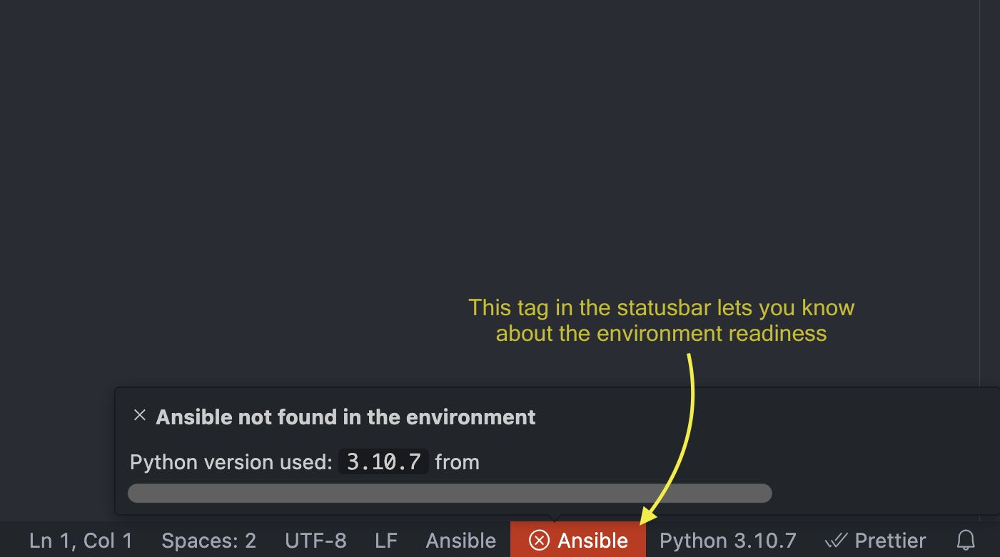

<!-- markdownlint-disable MD033 MD041 MD013-->

<figure align="center">
  
  <figcaption>Hovering on this tag in statusbar reveals more information about the environment</figcaption>
</figure>

 
 

<figure align="center">
  
  <figcaption>No color: All the tools are present</figcaption>
</figure>

<figure align="center">
  
  <figcaption>Yellow: Distronode Lint is missing</figcaption>
</figure>

<figure align="center">
  
  <figcaption>Red: Distronode is missing</figcaption>
</figure>
